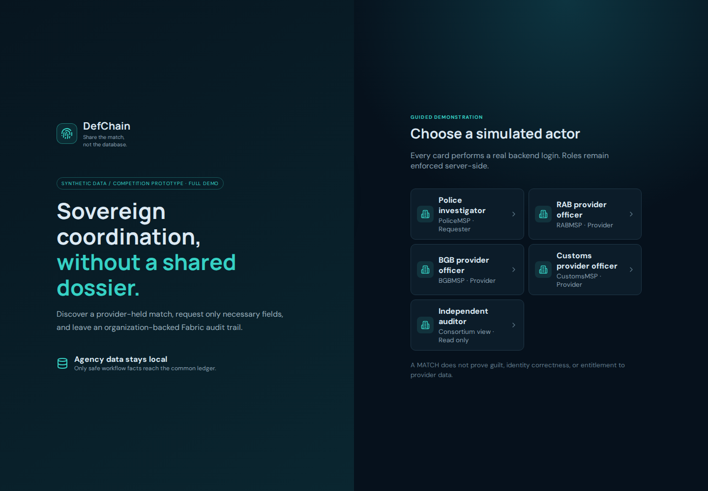
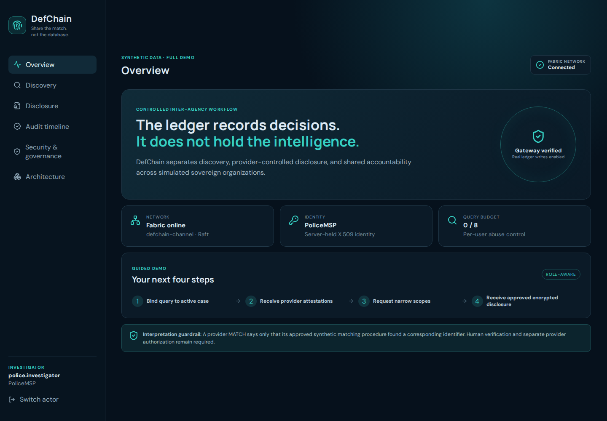
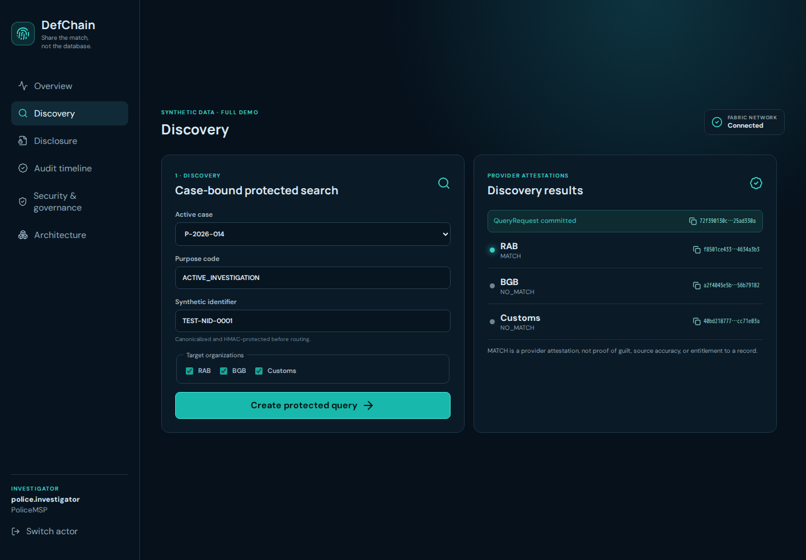
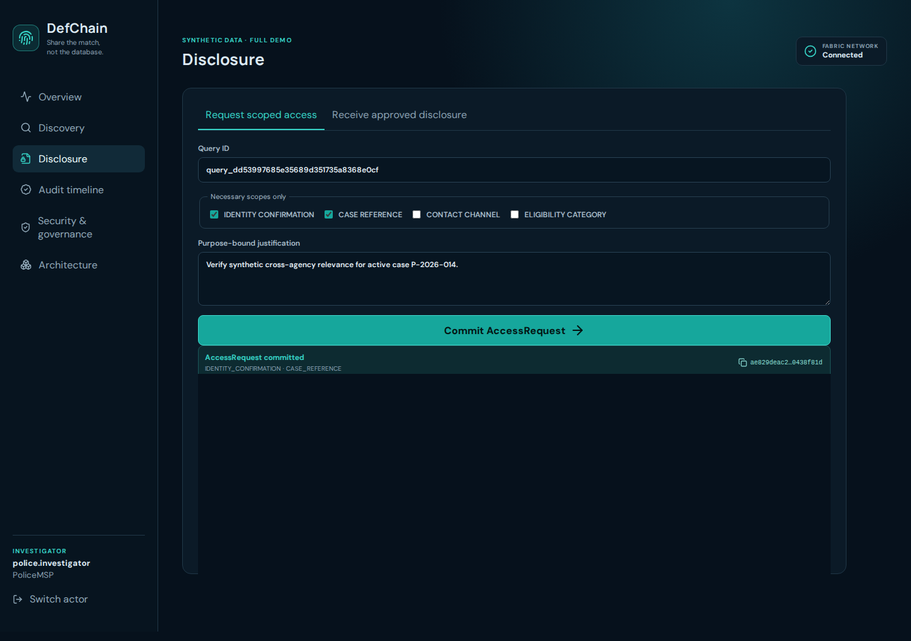
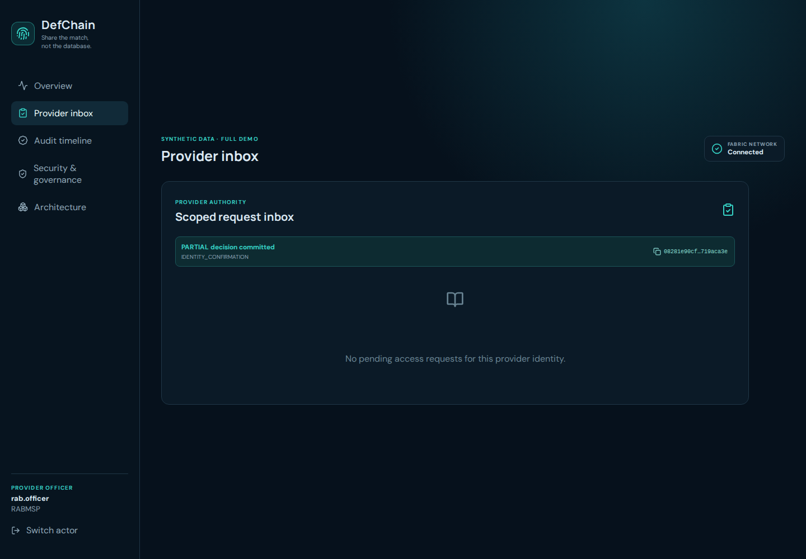
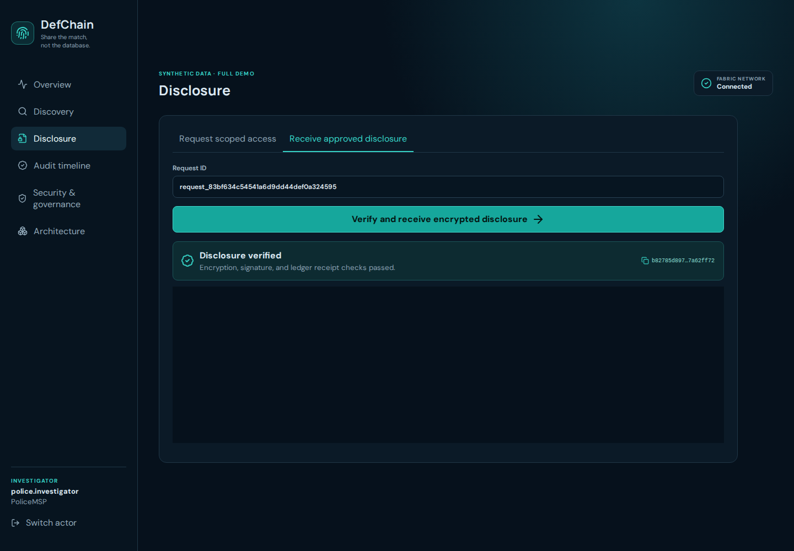
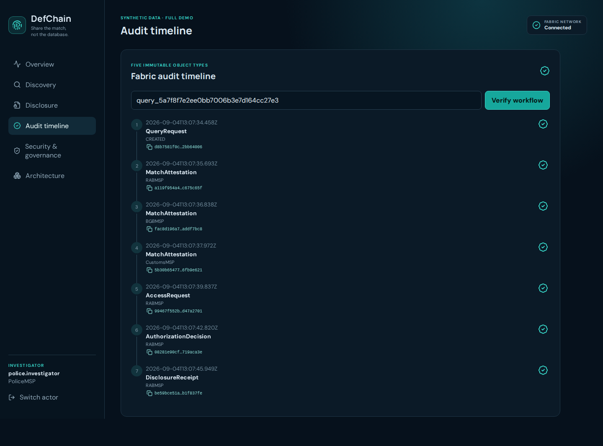
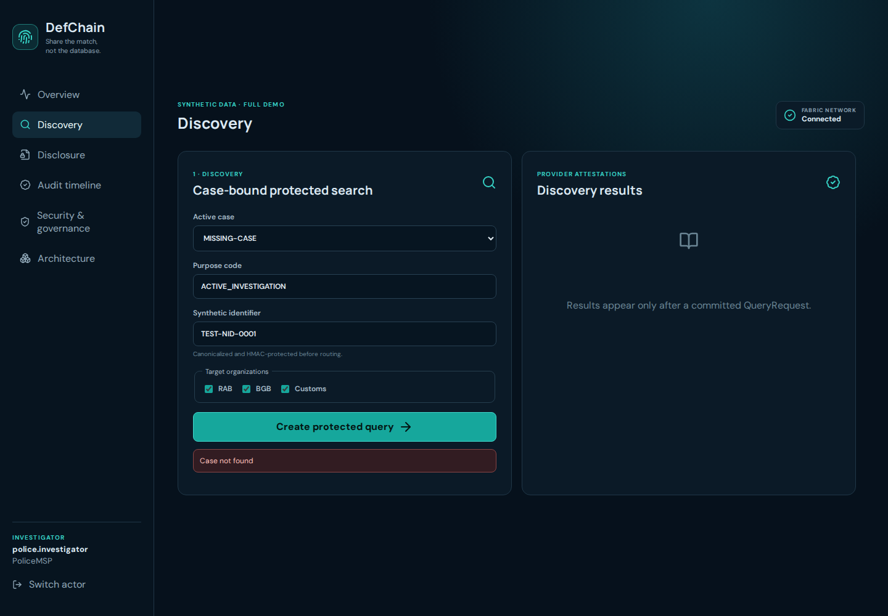

# DefChain

> **Share the match, not the database.**

DefChain is a privacy-conscious, permissioned inter-agency discovery and disclosure workflow prototype for the **Blockchain Olympiad Bangladesh 2026**.

Each simulated agency retains its own synthetic database. Hyperledger Fabric records jointly governed workflow facts—queries, match attestations, access requests, authorization decisions, and disclosure receipts—while raw identifiers and provider payloads remain off the common ledger.

DefChain demonstrates how authorized agencies can discover that another agency holds a relevant record **without sharing complete databases**, then request only the minimum required information through a provider-controlled and auditable workflow.

> **Competition prototype:** All agencies, users, cases, identities, and intelligence records used by the demo are synthetic or simulated. DefChain does not claim government access, partnership, production readiness, factual correctness of intelligence, or perfect privacy.

---

## Core idea

DefChain separates three responsibilities:

1. **Discover** — privacy-conscious protected matching determines whether another agency holds a relevant record.
2. **Authorize** — the data-owning agency can approve, partially approve, or deny a scoped disclosure request.
3. **Prove** — Hyperledger Fabric records the jointly governed authorization trail.

The blockchain records **decisions about intelligence — not the intelligence itself**.

### Five-stage workflow

```text
QueryRequest
     ↓
MatchAttestation
     ↓
AccessRequest
     ↓
AuthorizationDecision
     ↓
DisclosureReceipt
```

A `MATCH` is only a discovery signal. It is **not proof of guilt, factual correctness, or automatic entitlement to disclosure**.

---

## Quick start

### Requirements

The supported development environment is:

- Windows 11
- WSL2 Ubuntu
- Docker Desktop with WSL integration enabled
- Node.js 22
- npm 10
- Hyperledger Fabric 2.5.x tools

### First-time setup / clean full bootstrap

```bash
cp .env.example .env
npm install
npm run bootstrap
```

The full bootstrap creates the competition topology, including:

- PoliceMSP
- RABMSP
- BGBMSP
- CustomsMSP
- 4 Fabric peers
- 3 Raft orderers
- `defchain-channel`
- `defchain` TypeScript chaincode
- synthetic provider databases
- demonstration identities and cryptographic material

After bootstrap completes:

```bash
npm run dev:full
```

Open:

- Demo UI: http://localhost:5173
- API/Fabric health: http://localhost:4000/api/v1/health

### Normal startup after the project has already been bootstrapped

Normally you only need:

```bash
npm run dev:full
```

Keep the terminal running while using the application.

---

## Prototype screenshots

The following screenshots show the final full-mode competition workflow running against the DefChain backend and Hyperledger Fabric network.

### 1. Full demo login

Role-aware entry point for the simulated agencies and independent auditor.



---

### 2. Fabric-connected overview

The dashboard verifies that the application is connected to the real Hyperledger Fabric network.



---

### 3. Privacy-conscious provider discovery

Police performs a case-bound protected query. In the synthetic demonstration, **RAB returns `MATCH`**, while **BGB and Customs return `NO_MATCH`** without exposing their underlying records.



---

### 4. Scoped access request

A match does not automatically expose the provider record. The requester asks only for explicitly required disclosure scopes.



---

### 5. Provider authorization decision

The provider remains in control of its data and can **APPROVE**, **PARTIAL**, or **DENY** the requested disclosure.



---

### 6. Verified disclosure and blockchain receipt

Only approved fields are disclosed off-chain. The recipient verifies the protected disclosure and the system records a cryptographic receipt with a Fabric transaction ID.



---

### 7. Five-stage immutable audit timeline

The audit view reconstructs the complete governed workflow:

`QueryRequest → MatchAttestation → AccessRequest → AuthorizationDecision → DisclosureReceipt`



---

### 8. Abuse control and fail-closed behavior

Unauthorized or invalid actions—such as missing case authority, revoked users, or exhausted query budgets—are blocked rather than silently bypassing policy.



---

## Architecture

```text
                       ┌─────────────────────┐
                       │    React / Vite     │
                       │   Role-aware UI     │
                       └──────────┬──────────┘
                                  │
                                  ▼
                       ┌─────────────────────┐
                       │   Gateway API       │
                       │ Auth • Cases        │
                       │ Policy • Routing    │
                       └──────┬───────┬──────┘
                              │       │
              ┌───────────────┘       └───────────────┐
              ▼                                       ▼
       Agency adapters                         Hyperledger Fabric
   RAB • BGB • Customs                    Shared governance layer
              │
              ▼
      Independent local DBs
```

### Full competition topology

```text
PoliceMSP  ── peer0
RABMSP     ── peer0
BGBMSP     ── peer0
CustomsMSP ── peer0

              │
              ▼

      defchain-channel
              │
              ▼

    3-node Raft ordering service
```

The full prototype uses:

- **4 organization peers**
- **3 etcdraft/Raft orderers**
- **1 consortium channel:** `defchain-channel`
- **TypeScript CCAAS chaincode:** `defchain`
- organization-specific X.509/MSP identities

Raft provides crash-fault-tolerant ordering under majority availability; the prototype does **not** claim Byzantine fault tolerance.

---

## Repository map

- `apps/web` — React/Vite role-aware competition dashboard.
- `services/gateway-api` — authentication, case/query orchestration, policy enforcement, Fabric Gateway, and audit API.
- `services/agency-adapter` — reusable provider-side matching, authorization, disclosure, encryption, and signing service.
- `blockchain/chaincode` — TypeScript Fabric contract implementing the five workflow ledger object types.
- `blockchain/network` — lite/full Hyperledger Fabric topology and lifecycle scripts.
- `packages/fabric-client` — application-facing Hyperledger Fabric client.
- `packages/shared` — shared enums, Zod schemas, DTOs, and cryptographic helpers.
- `data/seeds` — explicitly synthetic deterministic fixtures.
- `assets/screenshots` — final prototype demonstration screenshots.
- `docs` — architecture, governance, threat model, API, tests, demo, and judging evidence.
- `tests` — workspace, security, integration, browser, and production verification tests.

Full startup, demo accounts, verified topology, test commands, limitations, and troubleshooting are documented in [docs/QUICKSTART.md](docs/QUICKSTART.md).

Current implementation status and blockers are documented in [PROGRESS.md](PROGRESS.md).

---

## Demo accounts

| Actor | Username | Password | Organization / role |
|---|---|---|---|
| Police investigator | `police.investigator` | `PoliceDemo!2026` | PoliceMSP / investigator |
| RAB officer | `rab.officer` | `RabDemo!2026` | RABMSP / provider |
| BGB officer | `bgb.officer` | `BgbDemo!2026` | BGBMSP / provider |
| Customs officer | `customs.officer` | `CustomsDemo!2026` | CustomsMSP / provider |
| Independent auditor | `auditor` | `AuditDemo!2026` | Read-only auditor |
| Revoked test user | `revoked.user` | `RevokedDemo!2026` | Disabled |
| Exhausted-budget user | `budget.exhausted` | `BudgetDemo!2026` | Zero query budget |

> These credentials are local demonstration fixtures and are not production credentials.

---

## Guided demonstration

### 1. Protected discovery

Log in as:

```text
police.investigator
```

Use:

```text
Case:       P-2026-014
Identifier: TEST-NID-0001
Purpose:    ACTIVE_INVESTIGATION
```

Target:

```text
RAB
BGB
Customs
```

Expected synthetic result:

```text
RAB       → MATCH
BGB       → NO_MATCH
Customs   → NO_MATCH
```

Each provider attestation is associated with a real Fabric transaction.

---

### 2. Scoped disclosure request

After the RAB match, request:

```text
IDENTITY_CONFIRMATION
CASE_REFERENCE
```

No provider dossier is automatically exposed.

---

### 3. Provider decision

Switch to:

```text
rab.officer
```

The RAB provider can choose:

```text
APPROVE
PARTIAL
DENY
```

A partial authorization can demonstrate that provider control applies at the field/scope level.

---

### 4. Verified disclosure

Return to Police and receive only the authorized fields.

The disclosure workflow uses:

- AES-256-GCM authenticated encryption
- SHA-256 payload hashing
- Ed25519 signatures
- Fabric-backed disclosure receipt

The disclosure payload itself remains off the common blockchain ledger.

---

### 5. Audit trail

Open the audit timeline to inspect:

```text
QueryRequest
MatchAttestation
AccessRequest
AuthorizationDecision
DisclosureReceipt
```

The audit view exposes organization, time, workflow state, and transaction evidence without exposing raw intelligence.

---

### 6. Abuse-control demonstration

The prototype also demonstrates rejected actions such as:

- missing active case
- unauthorized role
- revoked user
- exhausted query budget
- invalid workflow transition
- Fabric unavailable

DefChain fails closed for ledger-changing operations rather than silently falling back to a mock ledger.

---

## Privacy-preserving discovery

The MVP uses an HMAC-SHA-256 protected exact-match token:

```text
token = HMAC-SHA-256(
    epoch_key,
    domain || canonical_identifier
)
```

The raw identifier is not written to Fabric.

HMAC is intentionally described as an **MVP privacy mechanism**, not a production-perfect solution. Equality may still be observable within an epoch, and compromise of shared key material can enable enumeration.

Stronger production directions include:

- VOPRF / OPRF
- Private Set Intersection (PSI)
- HSM/KMS-backed key custody
- stronger compartmentalization and rotation

---

## On-chain / off-chain boundary

| Common Hyperledger Fabric ledger | Kept off-chain |
|---|---|
| Opaque case reference | Raw identifier |
| Purpose code | HMAC token and matching key |
| Requester/provider organizations | Provider record |
| MATCH / NO_MATCH result | Justification text |
| Requested disclosure scope | Disclosure payload |
| Approved disclosure scope | AES encryption key |
| APPROVE / PARTIAL / DENY decision | Ed25519 private key |
| Payload hash / signature reference | Passwords and JWTs |
| Ledger timestamp | Sensitive database content |
| Fabric transaction ID | Other provider-only information |

The design intentionally keeps intelligence records out of the common blockchain.

---

## Fabric workflow objects

DefChain represents the governed workflow through five immutable business objects.

### `QueryRequest`

Created by the requester after case, purpose, role, organization, and query-budget validation.

### `MatchAttestation`

Created by each targeted provider using its provider organization identity.

### `AccessRequest`

Created only after a valid `MATCH`. Contains the requested disclosure scopes, not the provider record.

### `AuthorizationDecision`

Written by the provider. Supports:

```text
APPROVE
PARTIAL
DENY
```

### `DisclosureReceipt`

Records cryptographic evidence that an approved disclosure occurred without placing the disclosure payload itself on the common ledger.

---

## Security controls

The prototype demonstrates:

- X.509 / MSP organization identity
- role-aware authorization
- active-case binding
- purpose limitation
- per-user query budgets
- HMAC-SHA-256 protected matching
- replay protection
- provider-controlled disclosure scope
- AES-256-GCM authenticated encryption
- SHA-256 payload hashes
- Ed25519 signatures
- Fabric transaction receipts
- immutable audit history
- revoked-user enforcement
- fail-closed Fabric behavior
- privacy leakage scanning of decoded blocks

---

## Why Hyperledger Fabric?

Private matching itself does not require blockchain.

DefChain uses blockchain only where multiple organizations need a **jointly governed state and audit history** without transferring control to one central administrator.

Hyperledger Fabric provides:

- permissioned organizational membership
- X.509/MSP identities
- peers representing independent organizations
- chaincode-enforced workflow rules
- endorsement
- replicated transaction history
- deterministic transaction validation
- consortium governance
- controlled network participation

There is:

- no cryptocurrency
- no mining
- no Proof of Work
- no token speculation
- no public intelligence ledger

---

## Topology and commands

### Lite topology

- PoliceMSP peer
- RABMSP peer
- one etcdraft/Raft orderer

### Full competition topology

- PoliceMSP peer
- RABMSP peer
- BGBMSP peer
- CustomsMSP peer
- three etcdraft/Raft orderers

### Common configuration

```text
Channel:   defchain-channel
Chaincode: defchain
```

---

## Development and verification

```bash
npm run build
npm test
npm run test:security
```

Real Fabric integration:

```bash
RUN_REAL_FABRIC_TESTS=true npm run test:integration
```

Production/full-mode verification:

```bash
FABRIC_NETWORK_MODE=full npm run verify:production
```

Additional verification:

```bash
npm run verify
npm run benchmark
```

See [docs/TEST_RESULTS.md](docs/TEST_RESULTS.md) for results that were actually observed during the final prototype validation.

See [docs/LIMITATIONS.md](docs/LIMITATIONS.md) for residual risks and production gaps.

---

## Important limitations

DefChain is a competition prototype and does **not** claim:

- government deployment or partnership
- access to actual Police/RAB/BGB/Customs databases
- production-grade cryptographic key custody
- perfect privacy
- Private Set Intersection already implemented
- VOPRF already implemented
- zero-knowledge proofs
- Byzantine fault tolerance
- correctness of source intelligence
- automatic determination of guilt
- legal authorization for real inter-agency deployment
- production scalability

A real deployment would require legal agreements, privacy-impact assessment, institutional governance, hardened PKI/key custody, independent security review, operational testing, and formal stakeholder approval.

---

## Project principle

> ### Share the match, not the database.

**Sovereign data custody. Provider-controlled disclosure. Shared authorization. Verifiable accountability.**
