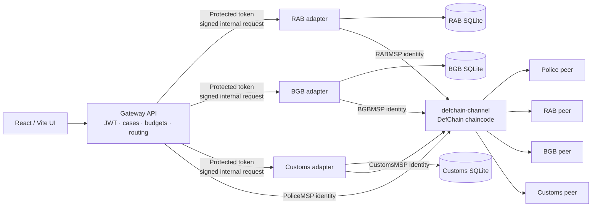

<div align="center">

# DefChain

### Share the match, not the database.

Privacy-conscious, permissioned inter-agency discovery and provider-controlled disclosure, backed by Hyperledger Fabric.

[Quick start](#quick-start) · [Guided demo](#guided-demo) · [Architecture](#architecture) · [Security](#security-model) · [Verification](#verified-project-status)

</div>


## Overview

DefChain is a working software prototype created for the **Blockchain Olympiad Bangladesh 2026**. It demonstrates how an authorized organization can discover whether another organization holds a relevant record without pooling agency databases or publishing sensitive records to a shared ledger.

Each simulated agency keeps its own SQLite database and makes its own disclosure decision. Hyperledger Fabric records the shared workflow facts needed for governance and auditability:

```text
QueryRequest
     ↓
MatchAttestation
     ↓
AccessRequest
     ↓
AuthorizationDecision
     ↓
DisclosureReceipt
```

The central principle is simple: **the blockchain records decisions about intelligence, not the intelligence itself.**

> [!IMPORTANT]
> DefChain is a competition prototype using synthetic identities, cases, users, and provider records. It does not claim government access, institutional partnership, production readiness, or that a match proves guilt or factual correctness.

## What the final prototype demonstrates

- Real Hyperledger Fabric 2.5.12 integration with no mock-ledger fallback.
- Four member organizations: PoliceMSP, RABMSP, BGBMSP, and CustomsMSP.
- Four peers and a three-node etcdraft/Raft ordering service in full mode.
- TypeScript chaincode deployed as an external CCAAS service.
- Independent provider adapters and separate SQLite databases for RAB, BGB, and Customs.
- Case-bound, purpose-limited, budget-controlled protected discovery.
- Selectable query targets: any non-empty combination of available providers.
- Provider-owned `APPROVE`, `PARTIAL`, and `DENY` decisions.
- AES-256-GCM disclosure, SHA-256 integrity evidence, and Ed25519 signatures.
- Fabric-backed query history with local timestamps and workflow-aware navigation.
- Clear separation of Query IDs, Request IDs, and Fabric transaction IDs.
- Role-aware React interface, provider inboxes, global copy feedback, and audit timeline.
- Fail-closed behavior when Fabric is unavailable.
- Decoded-block privacy leakage checks and ledger persistence verification.

## Architecture



The gateway coordinates the user journey, but it does not open provider databases. Each provider adapter receives only its own organization configuration, database, Fabric identity, and signing material. In Docker mode, adapter ports remain on an internal application network.

### Full Fabric topology

| Layer         | Final configuration                                               |
| ------------- | ----------------------------------------------------------------- |
| Organizations | PoliceMSP, RABMSP, BGBMSP, CustomsMSP                             |
| Peers         | One peer per organization                                         |
| Ordering      | Three etcdraft/Raft orderers                                      |
| Channel       | `defchain-channel`                                                |
| Chaincode     | `defchain`, TypeScript, external CCAAS service                    |
| Identities    | Organization-specific X.509/MSP identities with TLS               |
| Endorsement   | Member endorsement plus chaincode-enforced provider MSP ownership |

Raft provides crash-fault-tolerant ordering while a majority is available. The prototype does not claim Byzantine fault tolerance.

## Governed workflow

| Stage | Ledger record           | Created by             | What it proves                                                         |
| ----- | ----------------------- | ---------------------- | ---------------------------------------------------------------------- |
| 1     | `QueryRequest`          | Requester organization | An authorized, purpose-bound query targeted specific providers         |
| 2     | `MatchAttestation`      | Target provider        | The provider returned `MATCH` or `NO_MATCH` using its protected lookup |
| 3     | `AccessRequest`         | Requester organization | The requester asked for explicit, minimal disclosure scopes            |
| 4     | `AuthorizationDecision` | Data-owning provider   | The provider approved, partially approved, or denied the request       |
| 5     | `DisclosureReceipt`     | Data-owning provider   | An approved off-chain disclosure occurred with integrity evidence      |

### Identifier types

DefChain deliberately distinguishes three identifiers:

| Identifier            | Example shape                 | Purpose                                                                           |
| --------------------- | ----------------------------- | --------------------------------------------------------------------------------- |
| Query ID              | `query_...`                   | Application workflow identifier used in Discovery, Disclosure, History, and Audit |
| Request ID            | `request_...`                 | Identifier for a scoped access request handled by a provider                      |
| Fabric transaction ID | 64-character hexadecimal hash | Evidence that an individual ledger transaction was committed                      |

A Fabric transaction ID is not accepted where the application requires a Query ID.

## Privacy boundary

| Written to the shared Fabric ledger  | Kept off-chain                             |
| ------------------------------------ | ------------------------------------------ |
| Opaque case reference                | Raw identifier                             |
| Purpose code                         | HMAC token and matching key                |
| Requester and provider organizations | Provider source record                     |
| `MATCH` / `NO_MATCH` result          | Free-text justification                    |
| Requested and approved scopes        | Disclosure payload                         |
| Authorization decision               | AES encryption key                         |
| Payload hash and signature evidence  | Ed25519 private key                        |
| Ledger timestamp and transaction ID  | Passwords, JWTs, and authorization headers |

The MVP protects exact-match discovery with an HMAC-SHA-256 token derived from a canonical synthetic identifier and an epoch-bound key. The token is sent only to provider adapters and is never written to Fabric.

HMAC matching is intentionally presented as an MVP mechanism. Equality can remain observable within an epoch, and shared-key compromise can enable enumeration. Production research directions include VOPRF/OPRF, Private Set Intersection, stronger compartmentalization, and HSM/KMS-backed key custody.

## Quick start

### Prerequisites

Use the supported WSL2 environment for Fabric commands:

- Windows 11 with WSL2 Ubuntu
- Docker Desktop with Ubuntu WSL integration enabled
- Node.js 20 or 22 and npm 10+
- Git, Bash, curl, jq, and OpenSSL
- Docker Compose v2

From Windows PowerShell, check the host first:

```powershell
npm.cmd run preflight
```

Then open the repository in WSL Ubuntu.

### Full first-time bootstrap

```bash
cp .env.example .env
npm install
npm run bootstrap
npm run dev:full
```

Bootstrap downloads the pinned Fabric tools, creates the network and channel, deploys chaincode, creates local demonstration identities, seeds the independent synthetic databases, and verifies a real smoke transaction by querying it back.

Open:

- Web interface: <http://localhost:5173>
- API and Fabric health: <http://localhost:4000/api/v1/health>

The health response must report Fabric as available before ledger-changing actions are enabled.

### Returning startup

If the project is already bootstrapped:

```bash
npm run network:up
npm run dev:full
```

For the production-style containerized frontend and API after the Fabric network is available:

```bash
FABRIC_NETWORK_MODE=full docker compose \
  -f docker-compose.app.yml \
  --profile full up -d --build
```

### Lite development mode

```bash
npm run bootstrap:lite
npm run dev
```

Lite mode runs PoliceMSP, RABMSP, two peers, and one orderer. The default `npm run dev` intentionally uses lite mode; use `npm run dev:full` for all three provider organizations.

> [!CAUTION]
> `npm run reset` removes DefChain Fabric volumes and ignored runtime data before bootstrapping a known state. Use it only when a clean reset is intentional. Normal startup does not require it.

For detailed environment and recovery instructions, see [docs/QUICKSTART.md](docs/QUICKSTART.md) and [docs/TROUBLESHOOTING.md](docs/TROUBLESHOOTING.md).

## Guided demo

The login page provides role-aware demonstration actors. The local judge handoff is documented in [submission/DefChain_Demo_Credential.txt](submission/DefChain_Demo_Credential.txt); credentials are demonstration-only and must never be reused outside this local prototype.

### 1. Create a protected query

Sign in as the Police investigator and open **Discovery**.

| Field                | Value                  |
| -------------------- | ---------------------- |
| Active case          | `P-2026-014`           |
| Synthetic identifier | `TEST-NID-0001`        |
| Purpose              | `ACTIVE_INVESTIGATION` |
| Target organization  | Select only RAB        |

Expected result: RAB returns `MATCH`. Only the selected organization is submitted to the query API and shown in the provider results.

### 2. Use Fabric-backed History

Open **Disclosure → History**. The new Query ID appears first with:

- its original Fabric ledger timestamp formatted in local time;
- the selected target providers;
- a copy action with global success/error feedback.

Select the history row. Because access has not yet been requested, DefChain opens **Request scoped access** and prefills the correct `query_...` value and matching provider.

### 3. Request minimum scopes

Request only the fields required for the synthetic investigation, such as:

```text
IDENTITY_CONFIRMATION
CASE_REFERENCE
```

The provider record is not exposed at this stage.

### 4. Make the provider decision

Switch to the RAB provider officer and open **Provider inbox**. RAB can:

- approve every requested scope;
- partially approve a non-empty proper subset; or
- deny the request.

Provider identity and workflow-transition checks are enforced by chaincode, not only by the interface.

### 5. Receive and verify disclosure

Return to Police and select the query from **Disclosure → History**. An approved decision routes the row to **Receive approved disclosure** automatically.

The provider encrypts the authorized fields off-chain. Police verifies the encrypted result and signature, and Fabric receives a `DisclosureReceipt`. History remains sourced from Fabric and refreshes after each workflow action.

### 6. Inspect the audit timeline

Open **Audit timeline** with the same Query ID to reconstruct the five immutable ledger records and their Fabric transaction evidence.

## Final interface

<table>
  <tr>
    <td width="50%"></td>
    <td width="50%"></td>
  </tr>
  <tr>
    <td align="center"><strong>Role-aware full-mode entry</strong></td>
    <td align="center"><strong>Protected provider discovery</strong></td>
  </tr>
  <tr>
    <td></td>
    <td></td>
  </tr>
  <tr>
    <td align="center"><strong>Minimum-necessary access request</strong></td>
    <td align="center"><strong>Provider-controlled decision</strong></td>
  </tr>
  <tr>
    <td></td>
    <td></td>
  </tr>
  <tr>
    <td align="center"><strong>Verified off-chain disclosure</strong></td>
    <td align="center"><strong>Immutable workflow evidence</strong></td>
  </tr>
</table>

The complete eight-image evidence set, including Fabric connectivity and fail-closed abuse controls, is in [assets/screenshots](assets/screenshots).

## Security model

Implemented controls include:

- organization-backed X.509/MSP identities and TLS;
- JWT authentication plus active-user checks;
- role and organization authorization;
- active-case and purpose validation before ledger writes;
- per-user query budgets;
- requester self-target prevention;
- provider MSP ownership checks in chaincode;
- immutable record keys and legal workflow-transition enforcement;
- non-empty proper-subset enforcement for `PARTIAL` decisions;
- HMAC-SHA-256 protected exact matching;
- replay-resistant signed adapter requests;
- AES-256-GCM encryption, SHA-256 hashing, and Ed25519 signatures;
- decoded Fabric block scanning for configured privacy markers;
- fail-closed writes when Fabric is unavailable.

There is no in-memory, SQLite-ledger, or mock-blockchain fallback.

See [docs/SECURITY_CONTROLS.md](docs/SECURITY_CONTROLS.md), [docs/THREAT_MODEL.md](docs/THREAT_MODEL.md), and [docs/GOVERNANCE.md](docs/GOVERNANCE.md) for the security and institutional boundaries.

## Why Hyperledger Fabric?

Private matching alone does not require blockchain. DefChain uses Fabric where multiple organizations need jointly governed workflow state without assigning unilateral control of the audit history to one central database operator.

Fabric contributes:

- permissioned organizational membership;
- MSP-backed transaction identity;
- deterministic chaincode validation;
- endorsement and commit confirmation;
- replicated workflow history;
- controlled consortium participation.

DefChain has no cryptocurrency, mining, Proof of Work, public intelligence ledger, or token speculation.

## Repository structure

```text
apps/web                 React/Vite role-aware interface
services/gateway-api     Auth, policy, routing, Fabric Gateway, audit API
services/agency-adapter  Provider matching, decisions, encryption, signing
packages/fabric-client   Organization-aware Fabric client
packages/shared          Schemas, DTOs, privacy and cryptographic helpers
blockchain/chaincode      Five-record TypeScript smart contract
blockchain/network        Lite/full Fabric topology and lifecycle assets
data/seeds                Clearly synthetic deterministic fixtures
scripts                   Bootstrap, reset, verification and demo tooling
tests                     Security, integration and browser verification
assets/screenshots        Final full-mode demonstration evidence
docs                      Architecture, API, governance and judge material
```

## Verification

### Standard checks

```bash
npm run typecheck
npm run lint
npm run format:check
npm run build
npm test
npm run test:security
```

### Real Fabric checks

```bash
RUN_REAL_FABRIC_TESTS=true npm run test:integration
FABRIC_NETWORK_MODE=full npm run verify:production
npm run verify:persistence
npm run benchmark
```

The final frontend workflow test covers RAB-only selection, newest-first Fabric History, local time display, copy feedback, history-driven access, RAB approval, Police disclosure, and History refresh.

## Verified project status

The software prototype is implemented and has been exercised against real Fabric.

| Evidence                                    | Observed result                                                       |
| ------------------------------------------- | --------------------------------------------------------------------- |
| Workspace type checks, lint, and formatting | Passed                                                                |
| Production workspace build                  | Passed                                                                |
| Focused current frontend tests              | 8 passed                                                              |
| Real-Fabric integration suite               | Five-record lifecycle and negative invariants passed                  |
| Focused final browser workflow              | Passed against the full production-routed stack                       |
| Full topology                               | Four peers, three Raft orderers, four MSP approvals                   |
| Production routing                          | SPA fallback and `/api` separation passed                             |
| Ledger persistence                          | Query and transaction evidence survived a full container restart      |
| Privacy scan                                | Latest recorded full scan passed across 85 decoded blocks             |
| Correctness-oriented benchmark              | 55.863 ms average, 54.067 ms p50, 60.873 ms p95 across 10 evaluations |

The benchmark is a single-client evaluation sample on one WSL2 development machine. It is not a throughput, scalability, or production-capacity claim.

For the exact commands and evidence boundary, see [docs/TEST_RESULTS.md](docs/TEST_RESULTS.md) and [PROGRESS.md](PROGRESS.md).

## Limitations

DefChain does not claim:

- access to real Police, RAB, BGB, or Customs systems;
- government deployment, approval, or partnership;
- production-grade key custody or identity lifecycle management;
- perfect privacy or implementation of PSI/VOPRF;
- Byzantine fault tolerance;
- proof that provider intelligence is correct;
- automatic determination of guilt or entitlement;
- production scalability;
- legal authorization for real inter-agency deployment.

A real deployment would require legal agreements, privacy-impact assessment, formal consortium governance, hardened PKI and HSM/KMS key custody, independent security review, operational resilience testing, and institutional approval.

See [docs/LIMITATIONS.md](docs/LIMITATIONS.md) and [docs/FUTURE_WORK.md](docs/FUTURE_WORK.md).

## Documentation

| Document                                             | Purpose                                                        |
| ---------------------------------------------------- | -------------------------------------------------------------- |
| [Quick start](docs/QUICKSTART.md)                    | Setup, modes, accounts, reset, and troubleshooting entry point |
| [Architecture](docs/ARCHITECTURE.md)                 | Components, transaction path, topology, and custody boundaries |
| [API](docs/API.md)                                   | Existing HTTP contracts and error behavior                     |
| [Data model](docs/DATA_MODEL.md)                     | Frozen Fabric record schemas and identifier semantics          |
| [Security controls](docs/SECURITY_CONTROLS.md)       | Implemented safeguards and verification mapping                |
| [Threat model](docs/THREAT_MODEL.md)                 | Assets, adversaries, controls, and residual risks              |
| [Governance](docs/GOVERNANCE.md)                     | Consortium responsibilities and operational model              |
| [Demo script](docs/DEMO_SCRIPT.md)                   | Presenter-ready workflow                                       |
| [Judge Q&A](docs/JUDGE_QA.md)                        | Concise technical and governance answers                       |
| [Test results](docs/TEST_RESULTS.md)                 | Commands and results actually observed                         |
| [Submission checklist](docs/SUBMISSION_CHECKLIST.md) | Remaining human-owned packaging and deadline checks            |

---

<div align="center">

### Share the match, not the database.

**Sovereign data custody. Provider-controlled disclosure. Shared authorization. Verifiable accountability.**

</div>
