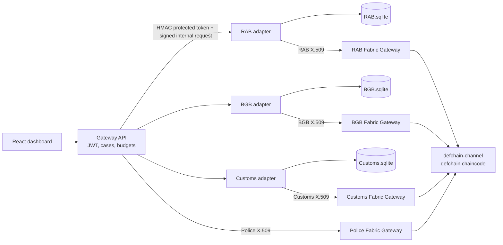
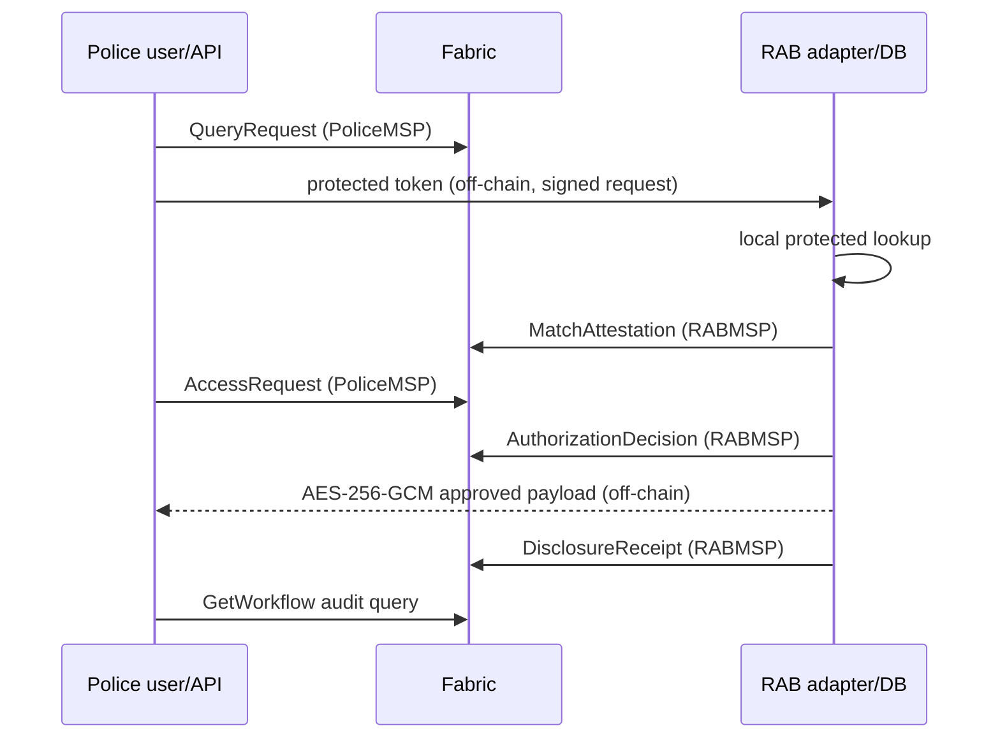

# Architecture

DefChain separates discovery, disclosure, and accountability. Fabric is used for shared organization-backed workflow state; private matching and payload delivery remain provider-controlled and off-chain.

## Transaction path

## Fabric topology

| Mode | Peers                                             | Orderers                                      | Status here                               |
| ---- | ------------------------------------------------- | --------------------------------------------- | ----------------------------------------- |
| Lite | PoliceMSP peer0:7051; RABMSP peer0:8051           | orderer0:7050, etcdraft/Raft                  | Configured; not run because Docker absent |
| Full | Lite + BGBMSP peer0:9051 + CustomsMSP peer0:10051 | orderer0/1/2 on 7050/8050/9050, etcdraft/Raft | Configured strong target; not run here    |

All modes use `defchain-channel`, `defchain` chaincode, cryptogen-generated local X.509 demo identities, TLS, and organization-specific Gateway connections. Chaincode endorsement permits a member peer, while provider-only operations additionally compare the invoker MSP to `providerOrg`. An auditor is an application-level read-only role and has no peer.

## Why not one database/API?

A central API is still useful for user experience, case checks, and routing, but its operator would otherwise control the only shared history. Fabric supplies member identity, endorsement, deterministic transitions, commit confirmation, and a ledger no simulated member can silently rewrite alone. It does not make source data true, decide guilt, compute HMACs, or replace provider authorization.

## Custody boundary

The gateway never opens provider SQLite files. Each adapter process receives only its organization configuration/database and holds its provider identity/signing key. Docker mode keeps adapters on an internal application network without published ports. Host development binds adapters to loopback only.
